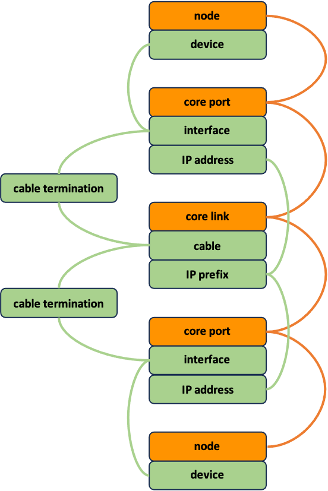
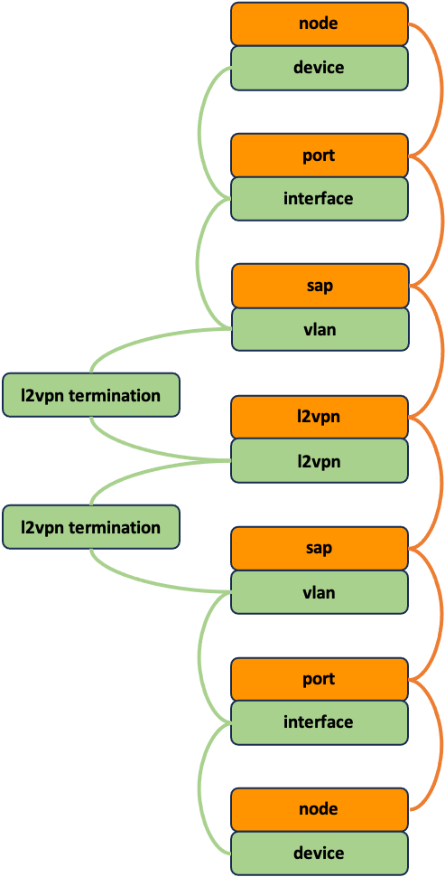

# Example Workflow Orchestrator

Example workflow orchestrator implementation based on the
[orchestrator-core](https://workfloworchestrator.org/orchestrator-core/) framework.

- [Quickstart](#quickstart)
    * [Start application](#start-application)
    * [Using the example orchestrator](#using-the-example-orchestrator)
- [Summary](#summary)
- [Introduction](#introduction)
- [Example orchestrator](#example-orchestrator)
    * [Folder layout](#folder-layout)
    * [Main application](#main-application)
    * [Implemented products](#implemented-products)
    * [How to use](#how-to-use)
- [Products](#products)
    * [Product types](#product-types)
    * [Product blocks](#product-blocks)
- [Workflows](#workflows)
    * [Create workflow](#create-workflow)
    * [Modify workflow](#modify-workflow)
    * [Terminate workflow](#terminate-workflow)
    * [Validate workflows](#validate-workflows)
- [Services](#services)
    * [Subscription descriptions](#subscription-descriptions)
    * [Netbox](#netbox)
- [Glossary](#glossary)

## Quickstart

### Start application

Make sure you have docker installed and run:

```
docker compose up
```

This will start the `orchestrator`, `orchestrator-ui`, `netbox`, `postgres` and `redis`.

To access the new v2 `orchestrator-ui`, point your browser to:

```
http://localhost:3000/
```


And to access `netbox` (admin/admin), point your browser to:

```
http://localhost:8000/
```

### Using the example orchestrator

Use the following steps to see the example orchestrator in action:

1. bootstrap Netbox
    1. from the `Tasks` page click `New Task`
    2. select `Netbox Bootstrap` and click `Start task`
    3. select `Expand all` on the following page to see the step details
2. create a network node (need at least two to create a core link)
    1. in the left-above corner, click on `New subscription`
    2. select either the `Node Cisco` or `Node Nokia`
    3. fill in the needed fields, click `Start workflow` and view the summary form
    4. click `Start workflow` again to start the workflow, or click `Previous` to modify fields
3. add interfaces to a node (needed by the other products)
    1. on the `Subscriptions` page, click on the subscription description of the node to show the details
    2. select `Update node interfaces` from the `Actions` pulldown
4. create a core link
    1. in the left-above corner, click on `New subscription`
    2. select either the `core link 10G` or `core link 100G`
    3. fill in the forms and finally click on `Start workflow` to start the workflow
5. create a customer port (need at least two **tagged** ports to create a l2vpn)
    1. use `New subscription` for either a `port 10G` or a `port 100G`
    3. fill in the forms and click on `Start workflow` to start the workflow
6. create a l2vpn
    1. use `New subscription` for a `l2vpn`, fill in the forms, and `Start workflow`

While running the different workflows, have a look at the following
netbox pages to see the orchestrator interact with netbox:

- Devices
    - Devices
    - Interfaces
- Connections
    - Cables
    - Interface Connections
- IPAM
    - IP Addresses
    - Prefixes
    - VLANs
- Overlay
    - L2VPNs
    - Terminations

## Summary

More and more NREN’s start automating and orchestrating their
operational network procedures and flows of information, making use of
the open-source Workflow Orchestrator. When a NREN creates an
orchestrator based on the WFO framework, custom integration code needs
to be written that is business specific. To accommodate NREN’s to help
each other while writing this code, and to facilitate collaboration for
the further development of the framework and to achieve a set of
standardized products and workflows, a set of best common practices
(BCP) is being set forth in this document.

To start with, a standard folder layout is described to organize the
custom integration code base, this helps in quickly finding similar code
in different implementations. To help illustrate the BCP, an example
orchestrator has been implemented for a virtual NREN. The defined
products model a network node, a core link between nodes, a customer
port, and a customer L2VPN service between those ports. For all products
the complete set of create, modify, terminate, and validate workflows
are implemented. Products and product blocks are described in Domain
Models that are designed to help the developer manage complex data
models and interact with the objects in a user-friendly way. The how and
why of this all is described in great detail.

Finally, the use of services is introduced. A service is collections of
helper functions that deliver a service to other parts of the code base.
The common programming pattern of function overloading is used for the
implementation of a service. A service can be as simple as the
generation of a description based on the product block domain model, or
a complete interface to query, create, update or delete objects in an
OSS or BSS. In the example orchestrator, a service is implemented to
interface with Netbox that is being used as IMS and IPAM. The mapping
between the product blocks and the objects in Netbox are described, and
the interface is fully implemented for the supported products.

The example orchestrator is fully functional and showcases how the WFO
can be integrated with Netbox.

## Introduction

To capture the Best Common Practices for implementing a network
orchestrator using the Workflow Orchestrator (WFO) software framework,
an example orchestrator is implemented that can be found at
<https://github.com/workfloworchestrator/example-orchestrator>. This
document can be seen as a reading guide for the code base that has been
written, and will highlight many of these practices and the reasoning
behind them. A basic understanding of the inner workings of the Workflow
Orchestrator is assumed up to a level as discussed in Milestone M7.3
Common NREN Network Service Product Models[^1] and is explained in the
workshops that can be found on the Workflow Orchestrator website[^2].
Basic knowledge on designing and operating computer networks and an
accompanying product portfolio and procedures is also assumed.

The products and workflows implemented in the example orchestrator are
based on a simple fictional NREN that has the following characteristics:

- The network consists of Provider and Provider Edge network nodes
- The network nodes are connected to each other through core links
- On top of this substrate a set of services like Internet Access, L3VPN and L2VPN are offered
- The Operations Support Systems (OSS) used are:
    - An IP Administration Management (IPAM) tool
    - A network Inventory Management System (IMS)
    - A Network Resource Manager (NRM) to provision the network
- There is no Business Support System (BSS) yet

This NREN decided on a phased introduction of automation in their
organisation, only automating some of the procedures and flows of
information while leaving others unautomated for the moment:

- Automated administration and provisioning of:
    - Network nodes including loopback IP addresses
    - Core links in between network nodes including point-to-point IP addresses
    - Customer ports
    - Customer L2VPN’s
- Not automated administration and provisioning of:
    - Role, make and model of the network nodes
    - Sites where network nodes are installed
    - Customer services like Internet Access, L3VPN, …
    - Internet peering

NetBox[^3] is used as IMS and IPAM, and serves as the source of truth
for the complete IP address administration and physical and logical
network infrastructure. It has a REST based API that makes it easy to
integrate with the Workflow Orchestrator.

## Example orchestrator

To automate the administration and provisioning of the nodes, core
links, customer ports and L2VPN’s of the virtual NREN, an orchestrator
is implemented making use of the WFO framework.

### Folder layout

Creating an orchestrator based on the WFO framework needs custom
integration code that is business specific. This code can be organised
like described below. A standard folder layout does not only make it
easier to navigate different orchestrator implementations, but also
helps with keeping the code organised while the number of products and
associated workflows increases. The following layout is recommended and
is, for example, also being used in the WFO workshops and by many of the
WFO users.

```
├── migrations
│   └── versions
│   └── schema
├── products
│   ├── product_blocks
│   ├── product_types
│   └── services
│   └── <service>
├── services
│ └── <service>
├── templates
├── translations
├── utils
└── workflows
├── <product>
└── tasks
```

#### migrations/versions/schema

This is the default location used by Alembic to store migration files.
Alembic is a lightweight database migration tool that is part of
SQLAlchemy[^4], and uses multiple HEAD’s to allow both the
orchestrator-core package and the implementation using this package to
maintain its own list of migrations. Usually there is at least a
migration file for each new product plus associated workflows that is
added to the implementation.

#### products/product_types

Each product has its own file, named after the product, that describes
the product domain model in all its lifecycle stages. For example, the
filename for a L2VPN product would be `l2vpn.py`.

#### products/product_blocks

Products can use one or more product blocks, and product blocks can be
shared by different products. Every product block that is defined, has a
file with the same name as the product block, to store the domain models
in all its lifecycle stages. For example, the core port product block
used by the core link product has a file called `core_port.py` in this
folder.

#### products/services

Collection of helper functions that deliver a service to product related
code. For example, the generation of descriptions, or payload for
OSS/BSS API’s, for different product and product blocks. For example,
the folder `products/services/netbox/` contains the NetBox API payload
service.

#### services

Similar to the product services but with code base wide helper
functions. For example, the folder `services/netbox/` contains the
service that interfaces with the NetBox API.

#### templates

List of product configuration templates, with a template per product.
Based on a template, currently an experimental feature, the WFO can
generate skeleton code for: the product and product block domain models,
all four types of workflows including input forms, registration of the
product and workflows, and the corresponding database migration.

#### translations

The translations for the WFO GUI for input form fields, subscriptions,
subscription instances, and workflows.

#### utils

A collection of helper functions that are not directly related to the
code base but are, for example, used to setup a deployment environment
or generate documentation.

#### workflows

Every product has a folder here, named after the product. Each folder
contains the collection of workflows for that product. Every workflow
has its own file, and the filename is prefixed with the type of
workflow. For example, the folder `workflows/port/` contains the
workflows for the Port product, and the file
`workflows/port/create_port.py` contains the Port subscription create
workflow.

#### shared

Throughout the code base, shared folders are used that contain helper
functions for that module and below. As good coding practice, it is best
to define the helper functions as locally as possible.

### Main application

The `main.py` can be as simple as shown below, and can be deployed by a
ASGI server like Uvicorn[^5].

```python	
from orchestrator import OrchestratorCore
from orchestrator.cli.main import app as core_cli
from orchestrator.settings import AppSettings

import products
import workflows

app = OrchestratorCore(base_settings=AppSettings())
app.register_graphql()

if __name__ == "__main__":
    core_cli()
```

All other orchestrator code is referenced by importing the `products`
and `workflows` modules. The application is started with:

```shell
uvicorn --host localhost --port 8080 main:app
```

To use the orchestrator command line interface use:

```shell
python main.py --help
```

### Implemented products

In the `product.product_types` module the following products are
defined:

- Node
- CoreLink
- Port
- L2vpn

And in the `product.product_blocks` module the following product blocks
are defined:

- NodeBlock
- CoreLinkBlock
- CorePortBlock
- PortBlock
- SAPBlock
- VirtualCircuitBlock

Usually, the top-level product block if a product is named after the
product, but this is not true for the top-level product block of the
L2VPN product. The more generic name `VirtualCIrcuitBlock` allows the
reuse of this product block by other services like Internet Access and
L3VPN.

The Service Access Point (SAP) product block `SAPBlock` is used to
encapsulate transport specific service endpoint information, in our case
Ethernet 802.1Q is used and the SAP holds the VLAN used on the indicated
port.

When this example orchestrator is deployed, it can create a growing
graph of product blocks as is shown below.

### Product Hiearchy Diagram
<center></center>

### How to use

human workflows regarding the delivery of products to customers are
often comprehensive. To limit the scope of this example orchestrator,
but still show the BCP while automating procedures, only inventory
management and provisioning are modeled. The implemented products and
workflows are designed with particular procedures in mind. For example,
it is assumed that the following is administered in IMS outside of the
orchestrator:

- Sites
- Device roles
- Device Manufactures
- Device Types
- IPv4 and IPv6 prefix for node loopback addresses
- IPv4 and IPv6 prefix for core link addressing

The task Netbox Bootstrap takes care of initializing Netbox with a
default set of this information. For convenience, a task Netbox Wipe is
added as well, that will remove all object from Netbox again, including
the ones that are created by the different workflows. Tasks can be found
in the orchestrator UI in the `New tasks` pulldown on the `tasks` page.

#### Node

The Node create workflow will read all configured, sites and device
roles, manufactures types, and allows the user to choose appropriate
values using dropdowns. The only thing that needs to be entered by hand
is a unique name for the node and an optional description. This is
enough to create a node subscription and administer the node in the IMS.

Network interfaces are installed in the nodes by field engineers. The
Node product has a “Update node interfaces” workflow that will discover
all interfaces on a physical node and will add or remove interfaces from
the IMS as needed. For this implementation, this workflow will always
return a preconfigured list of 10 and 100 Gbit/s network interfaces. In
real world implementation this could have been fetched from the network
device with SNMP, NETCONF, gNMI, or something similar. Only basic
information on the interfaces is added, which make them available to be
used by the create workflows of the core link and customer port
products.

There are variants of the node product that allow the creation of nodes
for different manufactures, and only the matching device types will be
shown in the dropdown.

#### CoreLink

To build a core link, at least two node subscription should already
exist, this is to satisfy the constraint that the A and B side of the
core link need to be different. On each node, there should be at least
one port available that matches the requested core link speed.

#### Port

To create a customer port, at least one node should exist with at least
one free interface of the requested port speed. The type of port can be
untagged, tagged, or link member, but note that currently only one
network service product is implemented, and that product only supports
tagged ports.

#### L2vpn

To create a L2VPN services for a customer, at least two customer ports
should exist, and every port can only be used once in the same L2VPN.
This product is only supported on tagged interfaces, and VLAN retagging
is not supported.

## Products

Products are described in Domain Models that are designed to help the
developer manage complex subscription models and interact with the
objects in a user-friendly way. Domain models use Pydantic[^6] with some
additional functionality to dynamically cast variables from the
database, where they are stored as a string, to their correct type in
Python at runtime. Pydantic uses Python type hints to validate that the
correct type is assigned. The use of typing, when used together with
type checkers, already helps to make the code more robust, and now
everything assigned to the model is also checked at runtime which
greatly improves reliability.

The definition of a product is divided into describing the product type
and the product blocks. The product type describes the fixed inputs and
the top-level product blocks. The fixed inputs are used to differentiate
between variants of the same product, for example the speed of a network
port. There is always at least one top level product block that contains
the resource types to administer the customer facing input. Beside
resource types, the product blocks usually contain links to other
product blocks as well. If a fixed input needs a custom type, then it is
defined here together with fixed input definition.

### Product types

The product types in the code are upper camel cased, like all other type
definitions. Per default, the product type is declared for the inactive,
provisioning and active lifecycle states, and the product type name is
suffixed with the state if the lifecycle is not active. Usually, the
lifecycle state starts with inactive, and then transitions through
provisioning to active, and finally to terminated. During its live, the
subscription, an instantiation of a product for a particular customer,
can transition from active to provisioning and back again many times,
before it ends up terminated. The terminated state does not have its own
type definition.

```python
class PortInactive(SubscriptionModel, is_base=True):
    speed: PortSpeed
    port: PortBlockInactive

class PortProvisioning(PortInactive, lifecycle=[SubscriptionLifecycle.PROVISIONING]):
    speed: PortSpeed
    port: PortBlockProvisioning

class Port(PortProvisioning, lifecycle=[SubscriptionLifecycle.ACTIVE]):
    speed: PortSpeed
    port: PortBlock
```

As can be seen in the above example, the inactive product type
definition is subclassed from SubScriptionModel, and the following
definitions are subclassed from the previous one. This product has one
fixed input called speed and one port product block (see below about
naming). Notice that the port product block matches the lifecycle of the
product, for example, the PortInactive product has a PortBlockInactive
product block, but it is totally fine to use product blocks from
different lifecycle states if that suits your use case.

Because a port is only available in a limited number of speeds, a
separate type is declared with the allowed values, see below.

```python
from enum import IntEnum

class PortSpeed(IntEnum):
    _1000 = 1000
    _10000 = 10000
    _40000 = 40000
    _100000 = 100000
    _400000 = 400000
```

This type is not only used to ensure that the speed fixed input can only
take these values, but is also used in user input forms to limit the
choices, and in the database migration to register the speed variant of
this product.

Products need to be registered in two places. All product variants have
to be added to the `SUBSCRIPTION_MODEL_REGISTRY`, in
`products/__init__.py`, as shown below.

```python
from orchestrator.domain import SUBSCRIPTION_MODEL_REGISTRY
from products.product_types.core_link import CoreLink

SUBSCRIPTION_MODEL_REGISTRY.update(
    {
        "core link 10G": CoreLink,
        "core link 100G": CoreLink,
    }
)
```

And all variants also have to entered into the database using a
migration. The migration uses the create helper function from
`orchestrator.migrations.helpers` that takes the following dictionary as
an argument, see below. Notice that the name of the product and the
product type need to match with the subscription model registry.

```python
from orchestrator.migrations.helpers import create

new_products = {
    "products": {
        "core link 10G": {
            "product_id": uuid4(),
            "product_type": "CoreLink",
            "description": "Core link",
            "tag": "CORE_LINK",
            "status": "active",
            "product_blocks": [
                "CoreLink",
                "CorePort",
            ],
            "fixed_inputs": {
                "speed": CoreLinkSpeed._10000.value,
            },
        },
}

def upgrade() -> None:
    conn = op.get_bind()
    create(conn, new_products)
```

### Product blocks

Like product types, the product blocks are declared for the inactive,
provisioning and active lifecycle states. The name of the product block
is suffixed with the word Block, to clearly distinguish them from the
product types, and again suffixed by the state if the lifecycle is not
active.

Every time a subscription is transitioned from one lifecycle to another,
an automatic check is performed to ensure that resource types that are
not optional are in fact present on that instantiation of the product
block. This safeguards for incomplete administration for that lifecycle
state. The resource types on an inactive product block are usually all
optional to allow the creation of an empty product block instance. All
resource types that are used to hold the user input for the subscription
is stored using resource types that are not optional anymore in the
provisioning lifecycle state. All resource types used to store
information that is generated while provisioning the subscription is
stored using resource types that are optional while provisioning but are
not optional anymore for the active lifecycle state. Resource types that
are still optional in the active state are used to store non-mandatory
information.

```python
class NodeBlockInactive(ProductBlockModel, product_block_name="Node"):
    type_id: int | None = None
    node_name: str | None = None
    ims_id: int | None = None
    nrm_id: int | None = None
    node_description: str | None = None

class NodeBlockProvisioning(NodeBlockInactive, lifecycle=[SubscriptionLifecycle.PROVISIONING]):
    type_id: int
    node_name: str
    ims_id: int | None = None
    nrm_id: int | None = None
    node_description: str | None = None

class NodeBlock(NodeBlockProvisioning, lifecycle=[SubscriptionLifecycle.ACTIVE]):
    type_id: int
    node_name: str
    ims_id: int
    nrm_id: int
    node_description: str | None = None
```

In the simplified node product block shown above, the type and the name
of the node are supplied by the user and stored on the
`NodeBlockInactive`. Then, the subscription transitions to Provisioning
and a check is performed to ensure that both pieces of information are
present on the product block. During the provisioning phase the node is
administered in IMS and the handle to that information is stored on the
`NodeBlockProvsioning`. Next, the node is provisioned in the NRM and the
handle is also stored. If both of these two actions were successful, the
subscription is transitioned to Active and it is checked that the type
and node name, and the IMS and NRM ID, are present on the product block.
The description of the node remains optional, even in the active state.
These checks ensure that information that is necessary for a particular
state is present so that the actions that are performed in that state do
not fail.

Sometimes there are resource types that depend on information stored on
other product blocks, even on linked product blocks that do not belong
to the same subscription. This kind of types need to be calculated at
run time so that they include the most recent information. Consider the
following example of a, stripped down version, of a port and node
product block, and a title for the port block that is generated
dynamically.

```python
class NodeBlock(NodeBlockProvisioning, lifecycle=[SubscriptionLifecycle.ACTIVE]):
    node_name: str

class PortBlock(PortBlockProvisioning, lifecycle=[SubscriptionLifecycle.ACTIVE]):
    port_name: str
    node: NodeBlock

    @serializable_property
    def title(self) -> str:
        return f"{self.port_name} on {self.node.node_name}"

class Port(PortProvisioning, lifecycle=[SubscriptionLifecycle.ACTIVE]):
    port: PortBlock
```

A `@serializable_property` has been added that will dynamically render
the title of the port product block. Even after a modify workflow was
run to change the node name on the node subscription, the title of the
port block will always be up to date. The title can be referenced as any
other resource type using subscription.port.title. This is not a random
example, the title of a product block is used by the orchestrator GUI
while displaying detailed subscription information.

## Workflows

Four types of workflows are defined, three lifecycle related ones to
create, modify and terminate subscriptions, and a fourth one to validate
subscriptions against the OSS and BSS. The decorators
`@create_workflow`, `@modify_workflow`, `@terminate_workflow`, and
`@validate_workflow` are used to define the different types of workflow,
and the `@step` decorator is used to define workflow steps that can be
used in any type of workflow.

Information between workflow steps is passed using `State`, which is
nothing more than a collection of key/value pairs, in Python represented
by a `Dict`, with string keys and arbitrary values. Between steps the
`State` is serialized to JSON and stored in the database. The step
decorator is used to turn a function into a workflow step, all arguments
to the step function will automatically be initialised with the value
from the matching key in the `State`. In turn the step function will
return a `Dict` of new and/or modified key/value pairs that will be
merged into the `State` to be consumed by the next step. The
serialization and deserialization between JSON and the indicated Python
types is done automatically. That is why it is important to correctly
type the step function parameters.

The input form is where a user can enter the details for a subscription
on a certain product at the start of the workflow, or can enter
additional information during the workflow. The input forms are
dynamically generated in the backend and use Pydantic to define the type
of the input fields. This also allows for the definition of input
validations. Input forms are (optionally) used by all types of workflows
to gather and validate user input. It is possible to have more than one
input form, with the ability to navigate back and forth between the
forms, until the last input form is submitted, and the first (or next)
step of the workflow is started. This allows for on-the-fly generation
of input forms, where the content of the following form(s) depend on the
input of the previous form(s). For example, when creating a core link
between two nodes, a first input form could ask to choose two nodes from
a list of active nodes, and the second form will present two lists with
ports on these two nodes to choose from.

While developing a new product, the workflows can be written in any
order. For those that use a test-driven development style probably will
start with the validate workflow. But in general people start with the
create workflow as it helps to discuss the product model (the
information involved) and the workflows (the procedures involved) with
the stakeholders to get the requirements clear. Once the minimal viable
create workflow is implemented, the validate workflow can be written to
ensure that all information is administered correctly in all touched OSS
and BSS and is not changed again by hand because human workflows were
not correctly adapted yet. Then after the terminate workflow is written,
the complete lifecycle of the product can be tested. Even when the
modify is not implemented, a change to a subscription can be carried out
by terminating the subscription and creating it again with the modified
input. Finally, the modify workflow is implemented to allow changes to a
subscription with minimal or no impact to the customer.

### Create workflow

A create workflow needs an initial input form generator and defines the
steps to create a subscription on a product. The `@create_workflow`
decorator adds some additional steps to the workflow that are always
part of a create workflow. The steps of a create workflow in general
follow the same pattern, as described below using the create node
workflow as an example.

```python
@create_workflow("Create node", initial_input_form=initial_input_form_generator)
def create_node() -> StepList:
    return (
        begin
        >> construct_node_model
        >> store_process_subscription(Target.CREATE)
        >> create_node_in_ims
        >> reserve_loopback_addresses
        >> provision_node_in_nrm
    )
```

1. Collect input from user (`initial_input_form`)
2. Instantiate subscription (`construct_node_model`):
    1. Create inactive subscription model
    2. assign user input to subscription
    3. transition to subscription to provisioning
3. Register create process for this subscription (`store_process_subscription`)
4. Interact with OSS and/or BSS, in this example
    1. Administer subscription in IMS (`create_node_in ims`)
    2. Reserve IP addresses in IPAM (`reserve_loopback_addresses`)
    3. Provision subscription in the network (`provision_node_in_nrm`)
5. Transition subscription to active and ‘in sync’ (`@create_workflow`)

As long as every step remains as idempotent as possible, the work can be
divided over fewer or more steps as desired.

The input form is created by subclassing the `FormPage` and add the
input fields together with the type and indication if they are optional
or not. Additional form settings can be changed via the Config class,
like for example the title of the form page.

```python
class CreateNodeForm(FormPage):
    model_config = ConfigDict(title=product_name)

    role_id: NodeRoleChoice
    node_name: str
    node_description: str | None = None
```

By default, Pydantic validates the input against the specified type and
will signal incorrect input and/or missing but required input fields.
Type annotations can be used to describe additional constraints, for
example a check on the validity of the entered VLAN ID can be specified
as shown below, the type `Vlan` can then be used instead of `int`.

```python
Vlan = Annotated[int, Ge(2), Le(4094), doc("Allowed VLAN ID range.")]
```

The node role is defined as type Choice and will be rendered as a
dropdown that is filled with a mapping between the role IDs and names as
defined in Netbox.

```python
def node_role_selector() -> Choice:
    roles = {str(role.id): role.name for role in netbox.get_device_roles()}
    return Choice("RolesEnum", zip(roles.keys(), roles.items()))

NodeRoleChoice: TypeAlias = cast(type[Choice], node_role_selector())
```

When more than one item needs to be selected, a `choice_list` can be
used to specify the constraints, for example to select two ports for a
point-to-point service:

```python
def ports_selector(number_of_ports: int) -> type[list[Choice]]:
    subscriptions = subscriptions_by_product_type("Port", [SubscriptionLifecycle.ACTIVE])
    ports = {str(subscription.subscription_id): subscription.description for subscription in subscriptions)}
    return choice_list(
        Choice("PortsEnum", zip(ports.keys(), ports.items())),
        min_items=number_of_ports,
        max_items=number_of_ports,
        unique_items=True,
    )

PortsChoiceList: TypeAlias = cast(type[Choice], ports_selector(2))
```

Validations between multiple fields is also possible by making use of
the Pydantic `@model_validator` decorator that gives access to all
fields. To check if the A and B side of a point-to-point service are not
on the same network node one could use:

```python
@model_validator(mode="after")
def separate_nodes(self) -> "SelectNodes":
    if self.node_subscription_id_b == self.node_subscription_id_a:
        raise ValueError("node B cannot be the same as node A")
    return self
```

For more information on validation, see the [Pydantic
Validators](https://docs.pydantic.dev/latest/concepts/validators/)
documentation

Finally, a summary form is shown with the user supplied values. When a
value appears to be incorrect, the user can go back to the previous form
to correct the mistake, otherwise, when the form is submitted, the
workflow is kicked off.

```python
summary_fields = ["role_id", "node_name", "node_description"]
yield from create_summary_form(user_input_dict, product_name, summary_fields)
```

### Modify workflow

A modify workflow also follows a general pattern, like described below.
The `@modify_workflow` decorator adds some additional steps to the
workflow that are always needed.

```pyrhon
@modify_workflow("Modify node", initial_input_form=initial_input_form_generator)
def modify_node() -> StepList:
    return (
        begin
        >> set_status(SubscriptionLifecycle.PROVISIONING)
        >> update_subscription
        >> update_node_in_ims
        >> update_node_in_nrm
        >> set_status(SubscriptionLifecycle.ACTIVE)
    )
```

1. Collect input from user (`initial_input_form`)
2. Necessary subscription administration (`@modify_workflow`):
    1. Register modify process for this subscription
    2. Set subscription ‘out of sync’ to prevent the start of other processes
3. Transition subscription to Provisioning (`set_status`)
4. Update subscription with the user input
5. Interact with OSS and/or BSS, in this example
    1. Update subscription in IMS (`update_node_in ims`)
    2. Update subscription in NRM (`update_node_in nrm`)
6. Transition subscription to active (`set_status`)
7. Set subscription ‘in sync’ (`@modify_workflow`)

Like a create workflow, the modify workflow also uses an initial input
form but this time to only collect the values from the user that need to
be changed. Usually, only a subset of the values may be changed. To
assist the user, additional values can be shown in the input form using
`ReadOnlyField`. In the example below, the name of the node is shown but
cannot be changed, the node status can be changed and the dropdown is
set to the current node status, and the node description is still
optional.

```python
class ModifyNodeForm(FormPage):
    node_name: ReadOnlyField(port.node.node_name)
    node_status: NodeStatusChoice = node.node_status
    node_description: str | None = node.node_description
```

After a summary form has been shown that lists the current and the new
values, the modify workflow is started.

```python
summary_fields = ["node_status", "node_name", "node_description"]
yield from modify_summary_form(user_input_dict, subscription.node, summary_fields)
```

### Terminate workflow

At the end of the subscription lifecycle, the terminate workflow updates
all OSS and BSS accordingly, and the `@terminate_workflow` decorator
takes care of most of the necessary subscription administration.

```python
@terminate_workflow("Terminate node",
initial_input_form=initial_input_form_generator)
def terminate_node() -> StepList:
    return (
        begin
        >> load_initial_state
        >> delete_node_from_ims
        >> deprovision_node_in_nrm
    )
```

1. Show subscription details and ask user to confirm termination (`initial_input_form`)
2. Necessary subscription administration (`@terminate_workflow`):
    1. Register terminate process for this subscription
    2. Set subscription ‘out of sync’ to prevent the start of other processes
3. Get subscription and add information for following steps to the State (`load_initial_state`)
4. Interact with OSS and/or BSS, in this example
    1. Delete node in IMS (`delete_node_in ims`)
    2. Deprovision node in NRM (`deprovision_node_in_nrm`)
5. Necessary subscription administration (`@terminate_workflow`)
    1. Transition subscription to terminated
    2. Set subscription ‘in sync’

The initial input form for the terminate workflow is very simple, it
only has to show the details of the subscription:

```python
class TerminateForm(FormPage):
    subscription_id: DisplaySubscription = subscription_id
```

### Validate workflows

And finally, the validate workflow, used to check if the information in
all OSS and BSS is still the same with the information in the
subscription. One way to do this is to reconstruct the payload sent to
the external system using information queried from that system, and
compare this with the payload that would have been sent by generating a
payload based on the current state of the subscription. The
`@validate_workflow` decorator takes care of necessary subscription
administration. There is no initial input form for this type of
workflow.

```python
@validate_workflow("Validate l2vpn")
def validate_l2vpn() -> StepList:
    return (
        begin
        >> validate_l2vpn_in_ims
        >> validate_l2vpn_terminations_in_ims
        >> validate_vlans_on_ports_in_ims
   )
```

1. Necessary subscription administration (`@validate_workflow`):
    1. Register validate process for this subscription
    2. Set subscription ‘out of sync’, even when subscription is already out of sync
2. One or more steps to validate the subscription against all OSS and BSS:
    1. Validate subscription against IMS:
        1. `validate_l2vpn_in_ims`
        2. `validate_l2vpn_terminations_in_ims`
        3. `validate_vlans_on_ports_in_ims`
3. Set subscription ‘in sync’ again (`@validate_workflow`)

When one of the validation steps fail, the subscription will stay ‘out
of sync’, prohibiting other workflows to be started for this
subscription. The failed validation step can be retried as many times as
needed until it succeeds, which finally will set the subscription ‘in
sync’ and allow other workflows to be started again. This safeguards
workflows to be started for subscription with mismatching information in
OSS and BSS which would make these workflows likely to fail.

It is better to limit the number of validations done in each step. This
will make it easier to see in a glance what discrepancy was found and
will make a retry of the failed step much faster. A commonly used
strategy is to use separate steps for each OSS and BSS, and separate
steps per external system for each payload that was sent. This can be
done by comparing a payload created for a product block in the
orchestrator with a payload that is generated by querying the external
system.

Not only validations per subscription can be done, is also possible to
validate other requirements. For example, to make sure that there are no
L2VPNs administered in IMS that do not have a matching subscription in
the orchestrator, a task (a workflow with `Target.SYSTEM`) can be
written that will retrieve a list of all L2VPNs from IMS and compare it
against a list of all L2VPN subscription from the orchestrator.

## Services

Services are collections of helper functions that deliver a service to
other parts of the code base. The common programming pattern of function
overloading is used for the implementation of the service. Function
overloading allows the use of multiple functions with the same name that
will execute the right function based on the type of the parameters.
Python does not allow function overloading, but similar functionality
can be achieved through the use of the single dispatch feature that is
part of the standard Python library.

First, an interface is defined and decorated with `@singledispatch`.
Then different nameless functions can be registered that implement that
interface but for different parameters. Note that only the first
parameter will be taken into account to decide which one of the
functions need to be execute.

A helper function called `single_dispatch_base()` is used to keep track
of all registered functions and the type of their first argument.  This
allows for more informative error messages when the single dispatch
function is called with an unsupported parameter.

### Subscription descriptions

An example of a service is the generation of descriptions for
subscriptions or product block instances, the description is generated
based on the type of subscription or product block instance. Organising
it this way, there is one place where every description is being
generated, and changes to the way a description is generated will
automatically appear in all places where that description is being used.

The description single dispatch allows a first argument of type product
model, product block model, or subscription model, and will call the
matching function.

```python
@singledispatch
def description(model: Union[ProductModel, ProductBlockModel, SubscriptionModel]) -> str:
    return single_dispatch_base(description, model)
```

Then, implementations of the description function can be registered,
like the generation of a description for a Node product, starting from
the provisioning lifecycle state, that will show the name of the node
followed by the status of the node in parenthesis.

```python
@description.register
def _(product: NodeProvisioning) -> str:
    return f"node {product.node.node_name} ({product.node.node_status})"
```

### Netbox

The Netbox service is an interplay between several single dispatch
functions, one to generate the payload for a specific product block, and
two others that create or modify an object in Netbox based on the type
of payload. The Pynetbox[^7] Python API client library is used to
interface with Netbox.

#### Payload

The `build_payload()` single dispatch allows a first argument of type
product block model, and a subscription model parameter that is used
when related information is needed from other parts of the subscription.
The specified return type is the base class that is used for all Netbox
payload definitions.

```python
@singledispatch
def build_payload(model: ProductBlockModel, subscription: SubscriptionModel, **kwargs: Any) -> netbox.NetboxPayload:
    return single_dispatch_base(build_payload, model)
```

When the payload is generated from a product block, the correct mapping
is made between the types used in the orchestrator and the types used in
the OSS or BSS. For example, the Port product block maps on the
Interface type in Netbox, as can be seen below.

```python
@build_payload.register
def _(model: PortBlockProvisioning, subscription: SubscriptionModel) -> netbox.InterfacePayload:
    return build_port_payload(model, subscription)

def build_port_payload(model: PortBlockProvisioning, subscription: SubscriptionModel) -> netbox.InterfacePayload:
    return netbox.InterfacePayload(
        device=model.node.ims_id,
        name=model.port_name,
        type=model.port_type,
        tagged_vlans=model.vlan_ims_ids,
        mode="tagged" if model.port_mode == PortMode.TAGGED else "",
        description=model.port_description,
        enabled=model.enabled,
        speed=subscription.speed * 1000,
    )
```

The values from the product block are copied to the appropriate place in
the Interface payload. The interface payload field names match the ones
that are expected by Netbox. The speed of the interface is taken from
the fixed input speed with the same name on the subscription, the
multiplication by 1000 is to convert between Mbit/s and Kbit/s.

#### Create

To create an object in Netbox based on the type of Netbox payload, the
single dispatch `create()` is used:

```python
@singledispatch
def create(payload: NetboxPayload, **kwargs: Any) -> int:
    return single_dispatch_base(create, payload)
```

When registering the payload type, a keyword argument is used to inject
the matching endpoint on the Netbox API that is used to create the
desired object. In the example below can be seen that interface payload
is to be used against the `api.dcim.interfaces` endpoint.

```python
@create.register
def _(payload: InterfacePayload, **kwargs: Any) -> int:
    return _create_object(payload, endpoint=api.dcim.interfaces)
```

Finally, the payload is used to generate a dictionary as expected by
that Netbox API endpoint. Notice that the names of the fields of the
Netbox payload have to match the names of the fields that are expected
by the Netbox API.

```python
def _create_object(payload: NetboxPayload, endpoint: Endpoint) -> int:
    object = endpoint.create(payload.dict())
    return object.id
```

The ID of the object that is created in Netbox is returned so that it
can be registered in the subscription for later reference, e.q. when the
object needs to be modified or deleted.

#### Update

The single dispatch `update()` is defined in a similar way, the only
difference is that an additional argument is used to specify the ID of
the object in Netbox that needs to be updated.

```python
@update.register
def _(payload: InterfacePayload, id: int, **kwargs: Any) -> bool:
    return _update_object(payload, id, endpoint=api.dcim.interfaces)
```

The ID is used to fetch the object from the Netbox API, update the
object with the dictionary created from the supplied payload, and send
the update to Netbox.

```python
def _update_object(payload: NetboxPayload, id: int, endpoint: Endpoint) -> bool:
    object = endpoint.get(id)
    object.update(payload.dict())
    return object.save()
```

#### Get

The Netbox service defines other helpers as well. For example, to get an
single object, or a list of objects, of a specific type from Netbox.

```python
def get_interfaces(**kwargs) -> List:
    return api.dcim.interfaces.filter(**kwargs)

def get_interface(**kwargs):
    return api.dcim.interfaces.get(**kwargs)
```

Both types of helpers accept keyword arguments that can be used to
specify the object(s) that are wanted. For example `get_inteface(id=3)`
will fetch the single interface object with ID equal to 3 from Netbox.
And `get_interfaces(speed=1000000)` will get a list of all interface
objects from Netbox that have a speed of 1Gbit/s.

#### Delete

Another set of helpers is defined to delete objects from Netbox. For
example, to delete an Interface object from Netbox, see below.

```python
def delete_interface(**kwargs) -> None:
    delete_from_netbox(api.dcim.interfaces, **kwargs)
```

The keyword arguments allow for different ways to select the object to
be deleted, as long as the supplied arguments result in a single object.

```python
def delete_from_netbox(endpoint, **kwargs) -> None:
    object = endpoint.get(**kwargs)
    object.delete()
```

#### Product block to Netbox object mapping

The modeling used in the orchestrator does not necessarily have to
match exactly with the modeling in your OSS or BSS. In many cases,
different names are used, or a one-to-many or many-to-one relation needs
to be created. To make a future transition to a different external
system as easy as possible, any needed mappings, or translations between
the models, are isolated in the workflow step(s) that deal with those
external systems as much as possible.

The diagram below shows the product blocks and relations as used in a
core link between two nodes, and how they map to the objects as
administered in Netbox. The product blocks are in orange and the Netbox
objects are in green.

<center></center>

And the following diagram shows the mapping and relation between product
blocks and Netbox objects for a L2VPN on customer ports between two
nodes.

<center></center>

## Glossary

<dl>
<dt> API  </dt><dd>  Application Programming Interface </dd>
<dt> ASGI </dt><dd>  Asynchronous Server Gateway Interface </dd>
<dt> BCP </dt><dd> Best Common Practice </dd>
<dt> BSS </dt><dd> Business Support System </dd>
<dt> gNMI </dt><dd> gRPC Network Management Interface </dd>
<dt> gRPC </dt><dd> generic Remote Procedure Call </dd>
<dt> GUI </dt><dd> Graphical User Interface </dd>
<dt> IMS </dt><dd> Inventory Management System </dd>
<dt> IPAM </dt><dd> IP Address Management </dd>
<dt> L2VPN </dt><dd> Layer 2 Virtual Private Network </dd>
<dt> L3VPN </dt><dd> Layer 3 Virtual Private Network </dd>
<dt> NETCONF </dt><dd> NETwork CONFiguration protocol </dd>
<dt> NREN </dt><dd> National Research and Education Network </dd>
<dt> OSS </dt><dd> Operation Support System </dd>
<dt> REST </dt><dd> REpresentational state transfer </dd>
<dt> SAP </dt><dd> Service Access Point </dd>
<dt> SNMP </dt><dd> Simple Network Management Protocol </dd><dt>
<dt> WFO </dt><dd> WorkFlow Orchestrator </dd>
</dl>

[^1]: M7.3 Common NREN Network Service Product Models -
https://resources.geant.org/wp-content/uploads/2023/06/M7.3_Common-NREN-Network-Service-Product-Models.pdf

[^2]: Workflow Orchestrator website -
https://workfloworchestrator.org/orchestrator-core/

[^3]: Netbox is a tool for data center infrastructure management and IP
address management - https://netbox.dev

[^4]: The Python SQL Toolkit and Object Relational Mapper -
https://www.sqlalchemy.org

[^5]: ASGI server Uvicorn - https://www.uvicorn.org

[^6]: Pydantic is a data validation library for Python -
https://pydantic.dev/

[^7]: Pynetbox Python API - https://github.com/netbox-community/pynetbox
